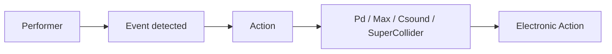

# Core Language Concepts

OpenScofo scores describe three things:

- What to listen for,
- What to do,
- When to do it.

```openscofo
NOTE C4 1
    sendto delay [1]

NOTE D4 1
    delay 1 tempo sendto granular [open]
```



## Mental Model

| Concept | Question | Reference |
| --- | --- | --- |
| Event | What should OpenScofo listen for? | [Musical Events](../score/events/) |
| Action | What should the computer do? | [Computer Actions](../score/actions/) |
| Time | When the computer should do it? | [Computer Actions](../score/actions/#action-reference) |
| Host | Where does `sendto` go? | [Platform Integrations](../integrations/#sendto-behavior) |

## Events

Events are the notated cues OpenScofo follows.

| Event | Use | Example |
| --- | --- | --- |
| `NOTE` | Single pitched event | `NOTE C4 1` |
| `CHORD` | Simultaneous pitches event (chord) | `CHORD (C4 E4 G4) 2` |
| `TRILL` | Alternating pitches (trill, tremolo) | `TRILL (D4 E4) 4` |
| `REST` | Silence (rest) | `REST 1` |
| `PTECH` | Pitched extended technique events | `PTECH tongue-ram C4 1` |
| `UTECH` | Unpitched extended technique events | `UTECH jet-whistle 2` |

Durations are beats relative to the current `BPM`. See [Pitch and Notation Conventions](../score/conventions/).

## Actions

Actions are computer responses attached to musical events.

| Action | Use | Example |
| --- | --- | --- |
| `sendto` | Send a message to the host | `sendto reverb [0.8]` |
| `delay ... sendto` | Schedule a message | `delay 1 tempo sendto delay [1]` |
| `luacall` | Run Lua logic (for complex actions) | `luacall(do_something_complex("A"))` |

Receivers commonly control delay, reverb, granular processing, video, projection, lights, freeze, or loop states.

## Time

`delay` schedules an action.

| Form | Meaning | Typical use |
| --- | --- | --- |
| `delay 500 ms` | Wait 500 milliseconds | fixed technical cue |
| `delay 2 sec` | Wait 2 seconds | fixed media timing |
| `delay 1 tempo` | Wait 1 beat at the estimated tempo | echoes, lighting cues, musical answers |

Use `tempo` when the response should stretch with the performer. For examples, see [Examples](../examples/).

## Pitch

Pitches can be written as names or MIDI numbers.

| Notation | Meaning |
| --- | --- |
| `C4` | middle C |
| `F#4`, `Bb3` | accidentals |
| `C+4`, `D-4` | quarter-tone notation |
| `60`, `60.5` | MIDI / microtonal MIDI |

Use this page for the concept; use the [Language Reference](../score/intro/) for syntax.
