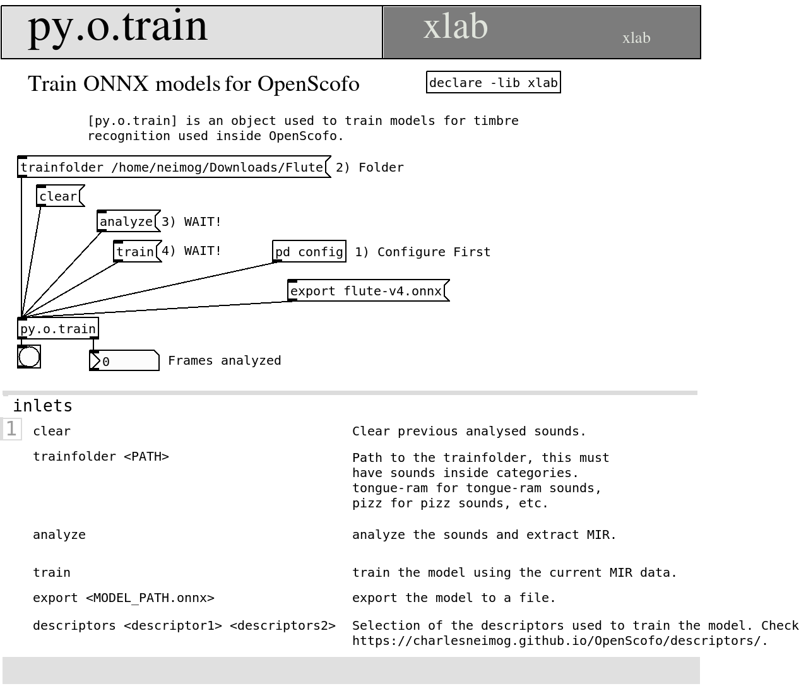
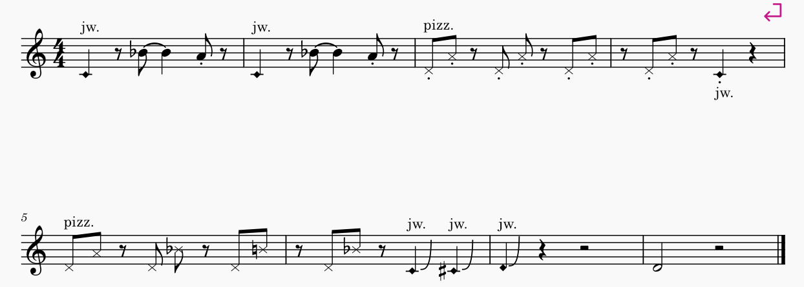

# AI Model

The AI model is designed for musicians working with expanded instrumental vocabularies, including extended techniques and non-traditional sounds. It can recognize not only conventional pitched material, but also gestural, percussive, and embodied sound sources such as body percussion, breath, vocal noises, and mouth sounds. The goal is to support performance contexts where sound extends beyond standard pitched instruments.

The model operates with **audio descriptors** provided by `OpenScofo` (see previous sections). These include amplitude, onset, time-domain, pitch, and spectral descriptors. To enable real-time detection, it must first be trained on labeled examples of the techniques and sound categories you want to recognize during performance.

---

## Training Overview

Training consists of three steps:

1. **Collect audio samples**
2. **Organize them into labeled folders**
3. **Extract features and train the model**

---

### 1. Dataset Structure

Audio files should be organized using a clear directory hierarchy:

* The **top-level folder** can have any descriptive name (e.g., `dataset`, `training_data`, `extended_techniques_dataset`).
* Each **subfolder corresponds to a technique or sound label** (e.g., `tongue-ram`, `jet-whistle`, `breath_noise`, `clapping`, `finger_snapping`).
* Each subfolder contains short (few seconds) audio examples (`.wav` or `.aif`) representing that specific class. These should be **isolated, representative samples**, not long continuous recordings (e.g., avoid 30-minute takes of a single technique such as tongue-ram).

Example structure

```python
Flute/
├── jet_whistle/
│   ├── jet-whistle_01.wav
│   ├── jet-whistle_02.wav
│   ├── jet-whistle_03.wav
│   └── ...
├── key_click/
│   ├── Fl-key_click_A#4.wav
│   ├── Fl-key_click_A4.wav
│   ├── Fl-key_click_F#4.wav
│   ├── Fl-key_click_F4.wav
│   ├── Fl-key_click_G#4.wav
│   └── ...
├── pizzicato/
│   ├── Fl-pizzicato_A#4.wav
│   ├── Fl-pizzicato_A4.wav
│   ├── Fl-pizzicato_B3.wav
│   └── ...
└── tongue_ram/
    ├── Fl-tongue_ram_A3.wav
    ├── Fl-tongue_ram_B3.wav
    ├── Fl-tongue_ram_C#3.wav
    └── ...
```

---

### 2. Feature Extraction

After preparing the dataset, select the audio descriptors used for training.

Commonly used feature set in my pieces:

* MFCC
* Log-mel spectrogram features
* Spectral centroid
* Spectral flatness
* High-frequency ratio
* Spectral flux
* Zero-crossing rate
* Irregularity

You may adjust this set depending on the target instrument and recording conditions, but consistency between training and inference is required.

---

### 3. Training Procedure

Once the dataset and feature set are defined:

1. Load all audio files from the dataset structure
2. Extract the selected audio descriptors
3. Train a **Random Forest classifier**
4. Save the trained model for inference in `OpenScofo`

---

### Practical Note

* The quality of classification depends more on **dataset quality and consistency** than on model complexity.
* Balanced representation across techniques is strongly recommended to avoid bias. For example, 80 samples of `tongue-ram` and just one `jet-whistle` is very bad.


## Training 

For now you can use Pure Data or Python to train these models.

### Pure Data

For Pure Data you can use the `py4pd` object + `py.o.train`. With these objects, you can easily train your model. To install it, you need to follow the steps:

1. Install last version of Python. You can check this link to install: [https://www.python.org/downloads/](https://www.python.org/downloads/).
2. Open Pure Data, Go to Tools, Find External, search for `py4pd` and install it;
3. Them add `declare -lib py4pd`  and create the object `py.o.train`.
4. Open the help patch of `py.o.train`. Read and explore it.




### Python

On Python, the `OpenScofo` module provide a class to allow this training. You can use it with the following script.

``` python
import OpenScofo

# sample_rate, fft_size and hop_size must be the same you will use in the score
trainer = OpenScofo.ExtendedTechniqueClassifier(
    sample_rate=48000,
    fft_size=2048,
    hop_size=512,
    model_type="catboost",  # or "lightgbm"
)

#       ONNXDESCRIPTORS mfcc logmel centroid flatness hfr flux zcr irregularity kurtosis
trainer.set_descriptors(
    [
        "mfcc",
        "logmel",
        "centroid",
        "flatness",
        "hfr",
        "flux",
        "zcr",
        "irregularity",
        "kurtosis",
    ]
)
trainer.set_train_folder("/home/neimog/Downloads/Flute")

# Impulse Responses are good to prevent overfit.
trainer.set_ir_folders(["/home/neimog/Nextcloud/MusicData/Impulse_Responses/05_Halls/"])
trainer.analyze()
trainer.train()
trainer.export_model("flute-v5.onnx")
```

## Score Example

Here one score example using a trained model.



This will be the score for OpenScofo:

```
/* Generated by OpenScofo online editor */

BPM 80

// Model Exported
ONNXMODEL flute-v5.onnx

// Descriptors used for train (exact same order)
ONNXDESCRIPTORS mfcc logmel centroid flatness hfr flux zcr irregularity kurtosis

// Measure number 1
UTECH jet_whistle 1
REST 0.5	
NOTE Bb4 1.5 // tied
NOTE A4 0.5
REST 0.5
	

// Measure number 2
UTECH jet_whistle 1
REST 0.5
NOTE Bb4 1.5 // tied
NOTE A4 0.5
REST 0.5

// Measure number 3
PTECH pizzicato D4 0.5
PTECH pizzicato A4 0.5
REST 0.5
PTECH pizzicato D4 0.5
PTECH pizzicato A4 0.5
REST 0.5
PTECH pizzicato D4 0.5
PTECH pizzicato A4 0.5

// Measure number 4
REST 0.5
PTECH pizzicato D4 0.5
PTECH pizzicato A4 0.5
REST 0.5
UTECH jet_whistle 1
REST 1
	
	

// Measure number 5
PTECH pizzicato D4 0.5
PTECH pizzicato A4 0.5
REST 0.5
PTECH pizzicato D4 0.5
PTECH pizzicato Bb4 0.5
REST 0.5
PTECH pizzicato D4 0.5
PTECH pizzicato B4 0.5

// Measure number 6
REST 0.5
PTECH pizzicato D4 0.5
PTECH pizzicato Bb4 0.5
REST 0.5
UTECH jet_whistle 1
UTECH jet_whistle 1

// Measure number 7
UTECH jet_whistle 1
REST 1
REST 2

// Measure number 8
NOTE D4 2
REST 2
``` 
