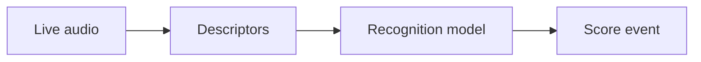

---
tags:
  - Audio Analysis
---

# Audio Analysis

OpenScofo uses audio descriptors for onset detection, pitch tracking, and AI models.

```openscofo
ONNXMODEL "flute.onnx"
ONNXDESCRIPTORS mfcc zcr centroid spread

PTECH pizz C4 1
    sendto sample [start pizz_echo]
```



## Reference Table

| Area | Use | Reference |
| --- | --- | --- |
| Amplitude | loudness, RMS, dB, silence | [Amplitude Descriptors](amplitude/) |
| Onset | attack detection | [Onset Descriptor](onset/) |
| Time / pitch | ZCR, pitch, confidence | [Time-Domain and Pitch Descriptors](time-pitch/) |
| Spectral | timbre, brightness, MFCC, chroma | [Spectral Descriptors](spectral/) |

!!! tip "Online descriptor test"
    [Test OpenScofo descriptors](https://charlesneimog.github.io/OpenScofo/descriptors/testing/){:target="_blank"}.

## Remarks

Compatibility icons:

- :custom-librosa: compatible with `librosa`
- :custom-essentia: compatible with `essentia`

See also: [AI Models](../ai/), [Advanced Configuration](../score/advanced-config/).
