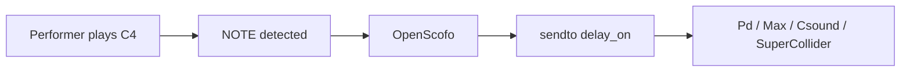
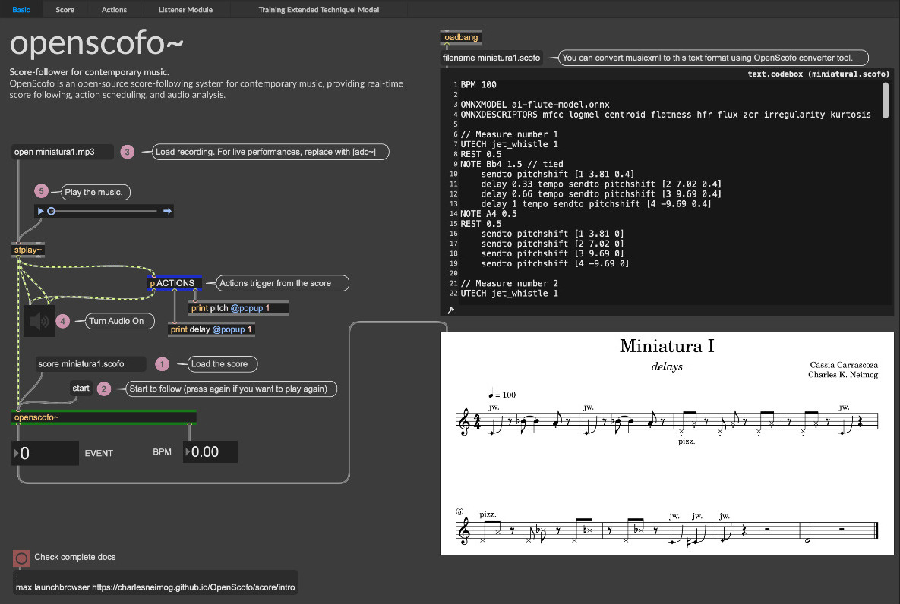

---
tags:
  - Getting Started
  - Host Integration
---

# Your First Interactive Patch

This page shows how to build actions with `sendto` keyword. Score syntax is introduced in [Your First Score](first-score/).

Use this score as `first-patch.scofo`:

```openscofo hl_lines="4 7"
BPM 60

NOTE C4 1
    sendto delay_on [1]

NOTE D4 1
    delay 1 tempo sendto delay_time [500]
```



## Host Receivers

| Host | Receiver for `sendto delay_on [1]` |
| --- | --- |
| Pure Data | `[r delay_on]` |
| Max | `[r delay_on]` |
| Csound | `instr delay_on`, scheduled with p-fields |
| SuperCollider | `~oscofo.listen("delay_on", { ... })` |

See [Platform Integrations](../integrations/) for host-specific `sendto` behavior.

## Pure Data

{width="80%"}

## Max

{width="80%"}

## Csound

In Csound, `sendto` schedules an instrument.

```openscofo
NOTE C4 1
    sendto 2 [0 1 0.7]
```

```csound
<CsoundSynthesizer>

<CsInstruments>
sr = 48000
ksmps = 64
nchnls = 1
0dbfs = 1

instr 1
    a1 diskin2 "./miniatura1.wav", 1, 0, 0
    kEvent, kBPM, kTrig OpenScofoScore a1, "./miniatura1-csound.scofo", 2048, 512
	printf "Event: %03d | BPM: %.2f\n", kTrig, kEvent, kBPM
   out a1
endin

instr 2
    iFreq = p4
    if iFreq <= 0 then
        iFreq = 440
    endif
    iAmp = p5
    if iAmp <= 0 then
        iAmp = 0.20
    endif
    aEnv linseg 0, 0.01, iAmp, p3 - 0.02, iAmp, 0.01, 0
    aTone poscil aEnv, iFreq
    //prints "OpenScofo scheduled instr 2: freq=%f amp=%f\\n", iFreq, iAmp
    out aTone
endin

instr namedPing
    iFreq = p4
    if iFreq <= 0 then
        iFreq = 880
    endif
    iAmp = p5
    if iAmp <= 0 then
        iAmp = 0.12
    endif
    aEnv linseg 0, 0.01, iAmp, p3 - 0.02, iAmp, 0.01, 0
    aTone poscil aEnv, iFreq
    out aTone
endin

</CsInstruments>

<CsScore>
i1 0 30
</CsScore>
</CsoundSynthesizer>
```

## SuperCollider

```supercollider
(
s.options.sampleRate = 48000;
s.waitForBoot {
    ~bus = Bus.audio(s, 1);
    ~namespace = "flute";
    ~buf = Buffer.read(s, "/home/neimog/Documents/Git/OpenScofo/Tests/miniaturas/Audios/miniatura1.mp3");

    SynthDef(\play, { |buf, bus, amp = 0.5|
        var sig = PlayBuf.ar(1, buf, BufRateScale.kr(buf), doneAction: 2);

        Out.ar(bus, sig);              // to OpenScofo
        Out.ar(0, (sig * amp) ! 2);    // to speakers
    }).add;

    s.sync;

    ~oscofo = OpenScofo.new(
        scorePath: "/home/neimog/Documents/Git/OpenScofo/Tests/miniaturas/Extras/miniatura1.scofo",
        inBus: ~bus,
        sampleRate: s.sampleRate,
        namespace: ~namespace,
        eventNotifications: true,
        eventAction: { |eventIndex| "Current Event Index: %".format(eventIndex).postln; }
    );

    // Receives score actions at /<namespace>/buffer-record.
    ~oscofo.listen("buffer-record", { |args, msg|
        var voice = args[0].asInteger;
        var bufferName = args[1].asString;
        var recording = args[2] != 0;

        ["buffer-record", voice, bufferName, recording].postln;
    });

    // Receives score actions at /<namespace>/buffer-play.
    ~oscofo.listen("buffer-play", { |args, msg|
        var voice = args[0].asInteger;
        var bufferName = args[1].asString;
        var gain = args[2];

        ["buffer-play", voice, bufferName, gain].postln;
    });

    ~player = Synth(\play, [\buf, ~buf, \bus, ~bus, \amp, 0.7]);
};
)
```

```openscofo
NOTE C4 1
    sendto delay_on [1]
```

For action syntax, see [Computer Actions](../score/actions/).
