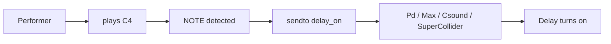

# Your First Score — 5 Minutes to Sound

Create `first-score.scofo`:

```openscofo
BPM 60

NOTE C4 1
    sendto delay_on [1]

NOTE D4 1
    delay 1 tempo sendto delay_time [500]
```

Result:

| Event | Action |
| --- | --- |
| performer plays `C4` | send `[1]` to `delay_on` |
| performer plays `D4` | after 1 tempo beat, send `[500]` to `delay_time` |



## Read the Score

| Line | Meaning |
| --- | --- |
| `BPM 60` | following tempo for subsequent events |
| `NOTE C4 1` | listen for `C4` lasting one beat |
| `sendto delay_on [1]` | send a host message immediately |
| `delay 1 tempo sendto ...` | schedule a message one followed beat later |

This page demonstrates the pattern. For the mental model, see [Core Language Concepts](../concepts/core-language-concepts/). For syntax, use the [Language Reference](../score/intro/).

## Try it in a host

In Pd or Max, create receivers named `delay_on` and `delay_time`, load `first-score.scofo` into `openscofo~`, start the follower, and play or sing `C4` then `D4`.

In Csound or SuperCollider, use the same score and follow the integration guide for `sendto`.

Next: [Your First Interactive Patch](first-interactive-patch/).
