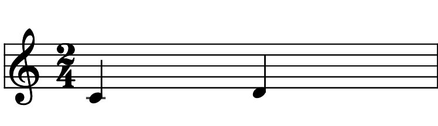

---
hide:
  - navigation
  - toc
tags:
  - Overview
---

<style>
  .md-typeset h1,
  .md-content__button {
    display: none;
  }
</style>

# OpenScofo

<p align="center" markdown>
  { width="15%" }
  { width="15%" }
</p>

<h4 latex="false" align="center"><i>Score following for contemporary music.</i></h4>

---

OpenScofo exists so live electronics can stay aligned with a human performer. It follows a notated score in real time and triggers computer actions at musical events.

<div class="grid cards" markdown>
- __Music Score__

    

- __OpenScofo Score__

    ```openscofo
    NOTE C4 1
    NOTE D4 1
        sendto activated_computer_processing [1]
    ```

</div>

--- 

## Composition Showcase


<div latex="false" class="grid cards" markdown>

- __Cânticos de Silício I (Charles K. Neimog) - 2025__

    <iframe width="560" height="315" src="https://www.youtube.com/embed/ym5nmBIzyh0?si=O_3TS0NRvKL3qRcD" title="YouTube video player" frameborder="0" allow="accelerometer; autoplay; clipboard-write; encrypted-media; gyroscope; picture-in-picture; web-share" referrerpolicy="strict-origin-when-cross-origin" allowfullscreen></iframe>

- __Miniatura I (Cássia Carrascoza | Charles K. Neimog) - 2025__ 

    <iframe width="560" height="315" src="https://www.youtube.com/embed/ym5nmBIzyh0?si=O_3TS0NRvKL3qRcD" title="YouTube video player" frameborder="0" allow="accelerometer; autoplay; clipboard-write; encrypted-media; gyroscope; picture-in-picture; web-share" referrerpolicy="strict-origin-when-cross-origin" allowfullscreen></iframe>

</div>


<div style="display: none" class="grid cards" markdown>

| Piece | Goal | Uses | Link |
| --- | --- | --- | --- |
| Miniatura I | delay synchronized with flute | pitch following, Pd | [interactive version](https://charlesneimog.github.io/OpenScofo/pieces/Miniaturas/Miniatura1/){:target="_blank"} |
| Miniatura II | responses aligned to performer pacing | pitch following, Pd | [interactive version](https://charlesneimog.github.io/OpenScofo/pieces/Miniaturas/Miniatura2/){:target="_blank"} |
| Canticos de Silicio I | browser performance | score following, pd4web | [interactive version](https://charlesneimog.github.io/Canticos-de-Silicio-I/){:target="_blank"} |
</div>

---

## What Can I Build?

<div class="grid cards" markdown>

- __Extended techniques__

    Recognize `PTECH` / `UTECH` labels with a trained model.

- __Live processing__

    delays, freeze, change reverb parameters, etc...

- __Synthesis__

    Trigger Csound or SuperCollider instruments!

- __Control Media__

    Video, lights, projections.


</div>

---

## Where Does It Run?

<div class="grid cards" markdown>

- __:custom-pd: Pure Data__

    Use [Pure Data](integrations/puredata/) for open-source live electronics and visual patching.

- __:custom-max: Max__ 

    Use [Max](integrations/max/) for a commercial, user-friendly environment for live electronics and interactive media.

- __:custom-csound: CSound__

    Use [Csound](integrations/csound/) for instrument scheduling.

- __:custom-supercollider: SuperCollider__ 

    Use [SuperCollider](integrations/supercollider/) synthesis, OSC-style, multithreading.

- :custom-vamp: __Vamp__ 

    Use [Vamp](integrations/vamp/) plugins for offline descriptor analysis.

- __Python, JavaScript, C++__

    Use [Python](integrations/python), [JavaScript](integrations/javascript) or [C++](integrations/cpp) for research, embedding, browser work.


</div>

!!! tip "OpenScofo Online Editor" 
    Use the [OpenScofo Online Editor](https://charlesneimog.github.io/OpenScofo/Editor/){:target="_blank"} to experiment in a browser.

---

## Fastest Path

1. [Your First Score](getting-started/first-score/)
2. [Your First Interactive Patch](getting-started/first-interactive-patch/)
3. [Core Language Concepts](concepts/core-language-concepts/)
4. [Platform Integrations](integrations/)

Use the [Language Reference](score/intro/) when you need exact syntax.

---


## Research Background

OpenScofo is an open-source score-following system for contemporary music and the [pd4web](https://charlesneimog.github.io/pd4web/){:target="_blank"} ecosystem. Its development is informed by Arshia Cont and the Antescofo team at IRCAM.
