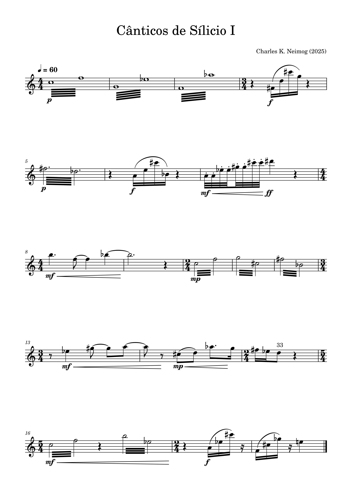

---
hide:
  - navigation
  - toc
---

# OpenScofo

  { width="15%" }
  { width="15%" }

<h4 latex="false" align="center"><i>Score-follower for contemporary music.</i></h4>

---

`OpenScofo` is an open-source score-following system designed for research in contemporary music. Its initial development was based on the research of Arshia Cont and the `Antescofo` team at IRCAM, particularly the paper *A Coupled Duration-Focused Architecture for Real-Time Music-to-Score Alignment*. Current development focuses on extending the system to support extended techniques commonly found in contemporary music. `OpenScofo` is currently in beta, and its API and features may change as development continues.

`OpenScofo` was initially developed to provide a minimal score-following system for the [pd4web](https://charlesneimog.github.io/pd4web/){:target="_blank"} ecosystem, enabling Pure Data patches to run directly in web browsers. By simplifying the deployment of live-electronics systems, it reduces the technical complexity of performances and makes interactive compositions more accessible to a broader range of performers.

-------------------------
## <h3 align="center"> **Compositions** </h3>
-------------------------

    <a href="https://charlesneimog.github.io/OpenScofo/pieces/Miniaturas/Miniatura1/" target="_blank" style="text-decoration: none; color: inherit;">
      

        

        
        
<i>Performed by Cássia Carrascoza</i>

        

      

    </a>

    <a href="https://charlesneimog.github.io/OpenScofo/pieces/Miniaturas/Miniatura2" target="_blank" style="text-decoration: none; color: inherit;">
      

        

        
        
<i>Performed by Cássia Carrascoza</i>

        

      

    </a>

    <a href="https://charlesneimog.github.io/OpenScofo/pieces/Miniaturas/Miniatura2" target="_blank" style="text-decoration: none; color: inherit;">
      

        

        
        
<i>Performed by Cássia Carrascoza</i>

        

      

    </a>

    
    <a href="https://charlesneimog.github.io/Canticos-de-Silicio-I/" target="_blank" style="text-decoration: none; color: inherit;">
      

        

        
        
<i>Performed by Sérgio Monteiro Freire</i>

        

      

    </a>

