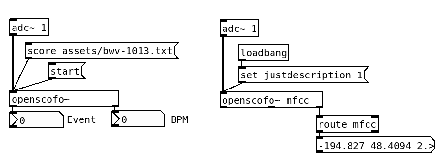

# Pure Data

**OpenScofo** is available in Pure Data as the `openscofo~` external. It can follow an OpenScofo score from a mono audio signal, report the current score event and tempo, execute score actions through Pure Data receivers, and output audio descriptors for real-time or offline analysis.

## Syntax

```puredata
[openscofo~]
[openscofo~ rms centroid mfcc]
```

Create `openscofo~` with no arguments for score following only. Pass descriptor names as creation arguments when you also want descriptor output from the analyzed signal.

## Inlets and Outlets

`openscofo~` has one signal inlet.

* **Signal inlet**: mono audio stream analyzed by OpenScofo.
* **Left outlet**: current score event index as a float.
* **Middle outlet**: current tempo in BPM as a float.
* **Right outlet**: descriptor messages, created only when descriptor names are passed as object arguments.

Descriptor messages use the descriptor id as the selector:

```puredata
mfcc <float...>
centroid <float>
onnx <label> <float>
```

## Basic Use

<p align="center">
    
</p>

If the filename has no extension, `openscofo~` looks for a `.scofo` file. Relative paths are resolved from the current patch.

## Messages

### `score`

Loads a score file using `score <score_path>`.

After a successful load, `openscofo~` resets the current event to `0`, outputs the current BPM and event index, and reads the score configuration such as FFT size and hop size.

### `start`

Starts following the loaded score from event `0`.

`start` clears pending actions, resets the follower to the beginning of the score, outputs the current BPM and event index, and enables following.

### `follow`

Enables or disables score following without reloading the score.

### `set verbosity`

Sets the amount of OpenScofo logging printed in the Pure Data console. The levels are `0` warning, `1` info, `2` debug, and `3` trace.

### `set description`

Switches descriptor-only processing on or off. This is useful when you create the object with descriptor arguments and want analysis output without score following.

### `set onnxmodel`

Loads an ONNX model and tells OpenScofo which descriptors were used to train it. The descriptor order must match the order used during model training.

### `get description`

Processes audio from a Pure Data array and outputs the requested descriptors once. `get descriptors <array-name> <sample-rate> <start-sample-index>`. The `<start-sample-index>` is optional argument is the start index inside the array. `openscofo~` reads one FFT window from that position, pads with zeroes if the array ends early, and sends descriptor messages through the descriptor outlet.

## Score Actions

OpenScofo score actions are delivered to Pure Data receivers. For example, this score fragment:

```text
NOTE C4 1
    sendto event-hit [1 C4]
    delay 1 tempo sendto event-hit [0 C4]
```

can be received in Pure Data with:

```puredata
[r event-hit]
```

If a `sendto` action has no arguments, `openscofo~` sends a bang. If it has arguments, it sends them as a Pure Data list. Action arguments can be numbers or symbols.

Lua actions in the score are executed by `openscofo~` when the external is built with Lua support. The Pure Data Lua module is available as `pd` inside score `LUA { ... }` blocks:

```text
LUA {
    function hello()
        pd.post("hello from OpenScofo")
        pd.send_bang("event-hit")
    end
}

NOTE C4 1
    luacall(hello())
```

See [Score Actions](../score/actions.md) and [Lua for Interactive Actions](../score/lua.md) for the score-language side.

## Descriptors

Request descriptors by passing their ids as creation arguments:

```puredata
[openscofo~ rms db centroid mfcc chroma]
```

When DSP is running, descriptors are output after each analyzed block. Vector descriptors such as `mfcc`, `chroma`, `logmel`, and `magnitude` output a list of floats. Scalar descriptors output one float.

The full descriptor reference is available in [Descriptors](../descriptors/index.md).
