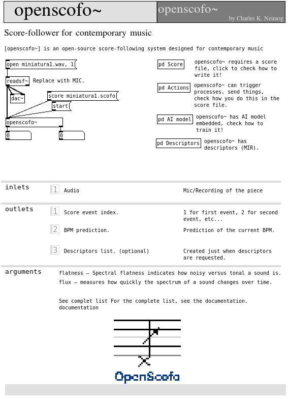

# Pure Data

## Overview

Use `[openscofo~]` to follow a score from a mono signal, report event/BPM, deliver actions to Pd receivers, and optionally output descriptors.

| Object | Use |
| --- | --- |
| `[openscofo~]` | score following |
| `[openscofo~ rms centroid mfcc]` | score following plus descriptor output |

## Installation

Install the Pure Data external (**Open Pd -> Tools -> Find Externals**, search and install `openscofo~`) from the OpenScofo release matching your platform, then restart Pd if needed.

## Minimal Example

After install `openscofo~`: 

- Create a new patch;
- Create an `openscofo~` object;
- Go to help of `openscofo~` object.

--- 

<p align="center" markdown>
  { width="60%" }
</p>

## Reference Table

### Messages / API

| Message | Purpose |
| --- | --- |
| `score <path>` | load a `.scofo` file |
| `start` | reset to event `0` and start following |
| `follow 1`, `follow 0` | enable or disable following |
| `section <name>` | silently reset following to a section; only the BPM outlet is updated |
| `set verbosity <0..3>` | set console logging level |
| `set description <0 or 1>` | enable descriptor-only processing |
| `set onnxmodel <path> <descriptors...>` | load an ONNX model with descriptor order |
| `get descriptors <array> <sample-rate> [start]` | analyze one FFT window from a Pd array |

Outlets:

| Outlet | Output |
| --- | --- |
| left | current score event index |
| middle | current BPM |
| right | descriptor messages, only when descriptors are requested |

## Score Actions

```openscofo
NOTE C4 1
    sendto delay [1 C4]
    delay 1 tempo sendto delay [0 C4]
```

Receive in Pd:

```text
[r delay]
```

No-argument `sendto` sends a bang; arguments are sent as a Pd list. For shared action syntax, see [Computer Actions](../score/actions/).

## Descriptors

Request descriptors as creation arguments:

```text
[openscofo~ rms db centroid mfcc chroma]
```

Vector descriptors such as `mfcc`, `chroma`, `logmel`, and `magnitude` output lists. Scalar descriptors output one float.

## Complete Example


See [Your First Interactive Patch](../getting-started/first-interactive-patch/) for the smallest complete patch.

## Remarks

Lua actions run when the external is built with Lua support. Inside `LUA { ... }`, use the `pd` module; see [Lua](../score/lua/).
