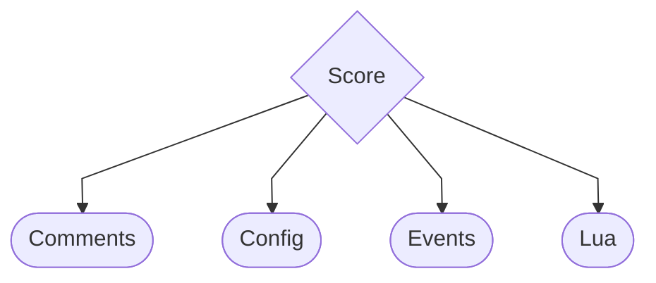
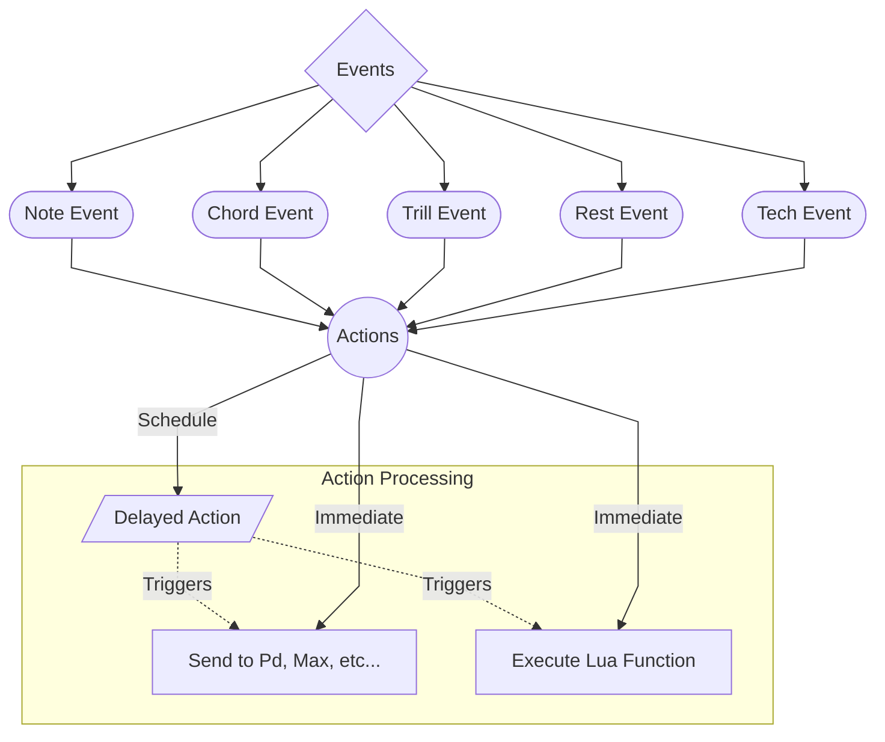

# Fundaments

Before we begin, let’s establish some fundaments of the `OpenScofo` score structure.

---
## Score Structure

The OpenScofo **Score** is the root of a composition. It organizes all components of your interactive score into four main sections:

* **Comments** – Optional textual notes or explanations in your score.
* **Config** – Global configuration settings such as tempo, FFT size, or machine learning models, etc.
* **Events** – The musical events (notes, chords, rests, trills, techniques, or Lua-triggered events) that drive the performance.
* **Lua** – Embedded Lua code for custom computations or interactions.

---

## Events and Actions

All **musical events** are organized under the **Events** node. OpenScofo supports several types of events:

* **Note Event** – Single pitched notes.
* **Chord Event** – Multiple pitches played simultaneously.
* **Trill Event** – Rapid alternation between two or more pitches.
* **Rest Event** – Silence for a given duration.
* **Tech Event** – Techniques or extended articulations.

Each event can have **Actions**, which are commands executed when the event occurs. These actions can be execute immediately when the event is detected or after a specified delay.

Both types of actions support two command modes:

* **Lua** – Execute Lua functions for custom behavior.
* **Send** – Send messages to external receivers (e.g., Pd, Max, or other targets).

Before check how to define configurations, events, and actions, it presented some conventions of `OpenScofo` related with note names, comments and others. If you already familiar with this you can jump to [Score Configuration](config.md).
