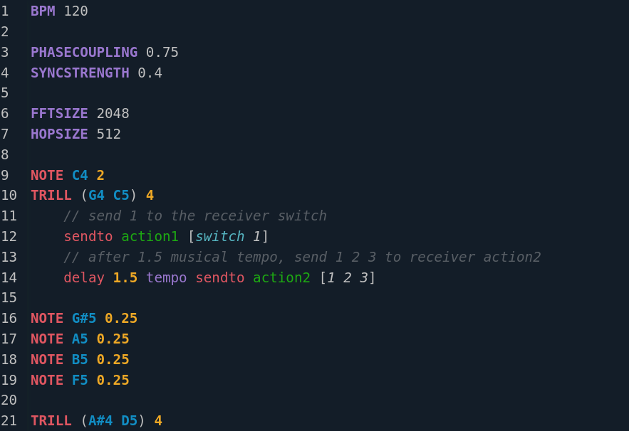

# Language Reference

An OpenScofo score is a plain-text `.scofo` file. It combines configuration, musical events, and computer actions.

```openscofo
// Minimal score
BPM 60

NOTE C4 1
    sendto delay [1]

NOTE D4 1
    delay 1 tempo sendto granular [open]
```

## File Structure

| Element | Purpose | Reference |
| --- | --- | --- |
| Comments | Human notes in the score | [Comments](#comments) |
| Configuration | Tempo, sample rate, low-level settings | [Configuring a Score](config/) |
| Events | What OpenScofo listens for | [Musical Events](events/) |
| Actions | What the computer does | [Computer Actions](actions/) |
| Lua | Optional custom logic | [Lua](lua/) |

## File Extension and Editors

Use `.scofo`.

- VS Code: [OpenScofo Language Parse extension](https://marketplace.visualstudio.com/items?itemName=charlesneimog.openscofo-language-parse){:target="_blank"}
- Neovim: [OpenScofo Neovim configuration](https://github.com/charlesneimog/OpenScofo/tree/main/Sources/Language/nvim){:target="_blank"}
- Browser: [OpenScofo Online Editor](https://charlesneimog.github.io/OpenScofo/Editor/){:target="_blank"}



## Comments

```openscofo
// one-line comment

/*
multi-line comment
*/
```

See also: [Core Language Concepts](../concepts/core-language-concepts/).
