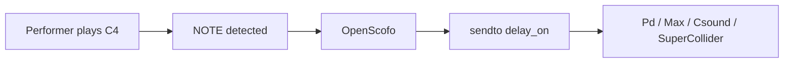

# Where Does It Run?

<div class="grid cards" markdown>

- __:custom-pd: Pure Data__

    Use [Pure Data](integrations/puredata/) for open-source live electronics and visual patching.

- __:custom-max: Max__ 

    Use [Max](integrations/max/) for a commercial, user-friendly environment for live electronics and interactive media.

- __:custom-csound: CSound__

    Use [Csound](integrations/csound/) for instrument scheduling.

- __:custom-supercollider: SuperCollider__ 

    Use [SuperCollider](integrations/supercollider/) synthesis, OSC-style, multithreading.

- :custom-vamp: __Vamp__ 

    Use [Vamp](integrations/vamp/) plugins for offline descriptor analysis.

- __Python, JavaScript, C++__

    Use [Python](integrations/python), [JavaScript](integrations/javascript) or [C++](integrations/cpp) for research, embedding, browser work.

</div>

## Simple Example 

This page shows how to build actions with `sendto` keyword. Score syntax is introduced in [Your First Score](first-score/).

Use this score as `first-patch.scofo`:

```openscofo hl_lines="4 7"
BPM 60

NOTE C4 1
    sendto delay_on [1]

NOTE D4 1
    delay 1 tempo sendto delay_time [500]
```




!!! tip "OpenScofo Online Editor" 
    Use the [OpenScofo Online Editor](https://charlesneimog.github.io/OpenScofo/Editor/){:target="_blank"} to experiment in a browser.

---

## Host Receivers

| Host | Receiver for `sendto delay_on [1]` |
| --- | --- |
| Pure Data | `[r delay_on]` |
| Max | `[r delay_on]` |
| Csound | `instr delay_on`, scheduled with p-fields |
| SuperCollider | `~oscofo.listen("delay_on", { ... })` |
